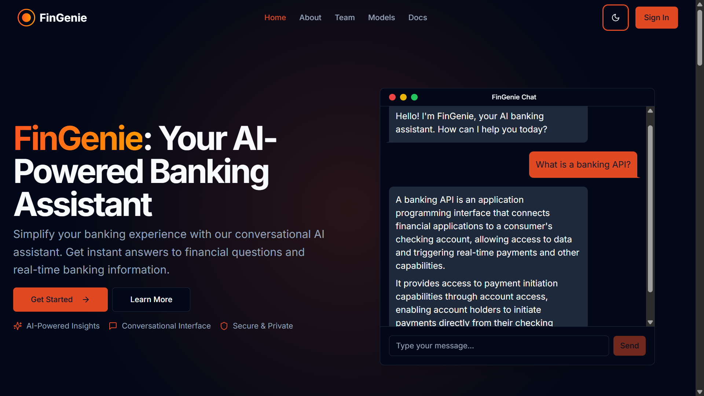
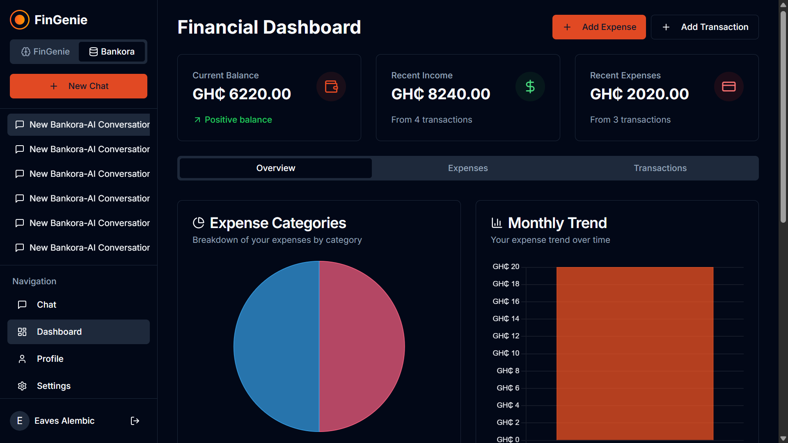
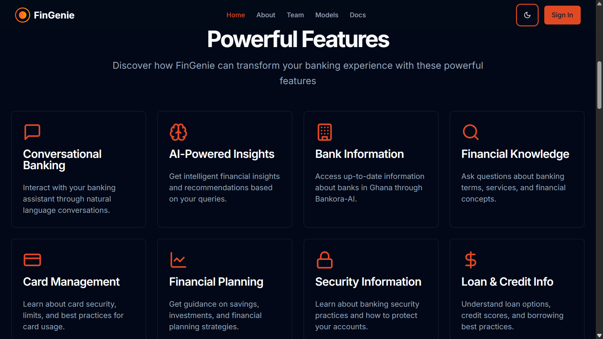
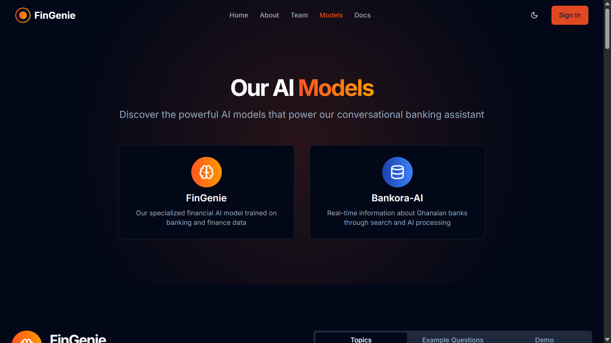
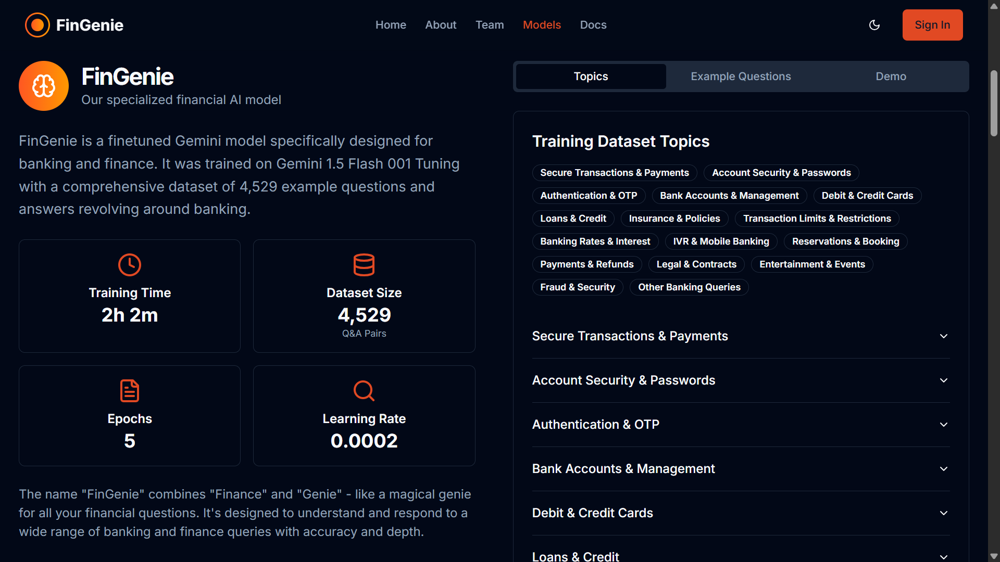
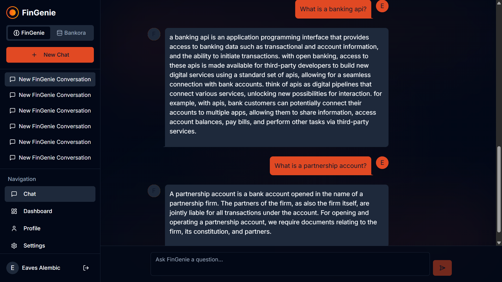
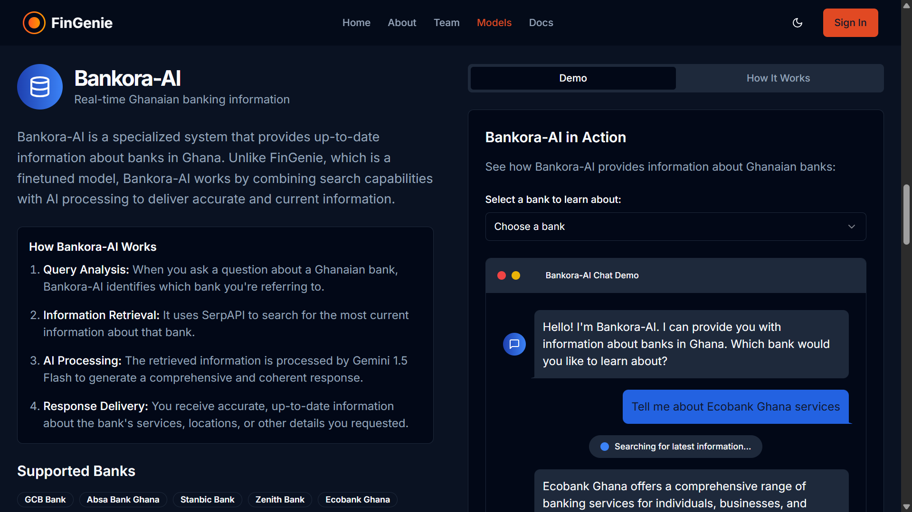
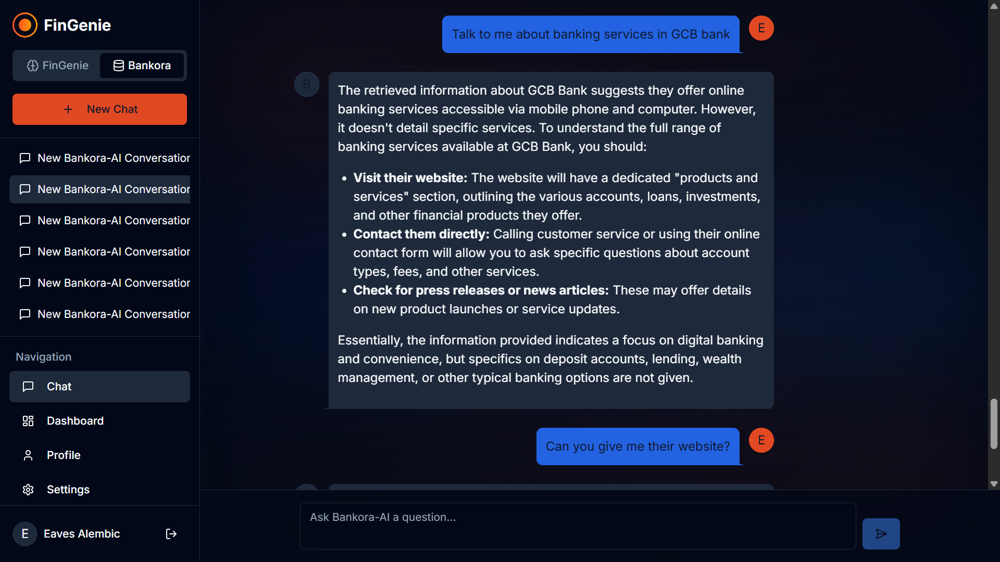
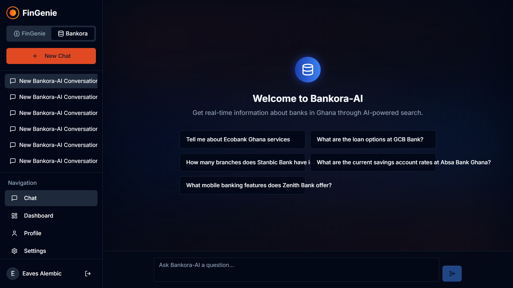

# FinGenie: AI-Powered Banking Assistant

FinGenie is a Next.js application that transforms the banking experience through AI-powered conversational interfaces. The platform provides users with instant answers to financial questions, expense tracking, and personalized financial advice through natural language interaction.

## 🌟 Overview

FinGenie simplifies banking by making financial information accessible through natural conversation. Traditional banking apps often require users to navigate complex interfaces, but FinGenie allows users to simply ask questions and receive immediate, helpful responses through a chat interface.

## 📸 Screenshots

Here's a visual tour of FinGenie's key features and interfaces:

### Landing Page

*The FinGenie landing page showcasing the AI-powered banking assistant.*

### Dashboard Interface

*The comprehensive financial dashboard with expense tracking and visualization tools.*

### Features Overview

*Key features of the FinGenie platform.*

### AI Models

*Overview of the AI models powering FinGenie.*

#### FinGenie Model

*Details about the FinGenie AI model and its capabilities.*

*Sample conversation with the FinGenie AI model.*

#### Bankora Model

*Details about the Bankora AI model focused on Ghanaian banking.*

*Sample conversation with the Bankora AI model.*

### Chat Interface

*The intuitive chat interface for interacting with FinGenie's AI assistants.*

## 📊 Dashboard Features

The FinGenie dashboard serves as a central hub for users to manage and visualize their financial information:

### Financial Summary

- **Expense Tracking**: Interactive charts and visualizations to track spending patterns over time
- **Transaction Management**: Comprehensive view of recent transactions with filtering and sorting capabilities
- **Budget Analysis**: Compare actual spending against budget targets
- **Category Breakdown**: Visual representation of expenses by category (e.g., food, transportation, utilities)

### Interactive Charts

- **Expense Charts**: Dynamic pie and bar charts showing expense distribution
- **Trend Analysis**: Line charts to track financial trends over time
- **Spending Patterns**: Visual identification of spending habits and potential saving opportunities

### Transaction Features

- **Add Transactions**: Easily log new financial transactions through a user-friendly form
- **Transaction History**: Comprehensive list of past transactions with search and filter functionality
- **Expense Categories**: Organize and track expenses across customizable categories
- **Transaction Details**: View detailed information about individual transactions

### User Experience

- **Tabbed Interface**: Easily switch between different financial views (expenses, transactions, summary)
- **Responsive Design**: Optimized for both desktop and mobile experiences
- **Real-time Updates**: Dashboard refreshes as new financial data is added
- **Data Visualization**: Clear, intuitive visualizations to understand financial status at a glance

## 🤖 AI Models

FinGenie leverages two specialized AI models to provide different types of banking assistance:

### 1. FinGenie-AI

- **Model Type**: Finetuned Gemini 1.5 Flash
- **Training**: Trained on 4,529 banking Q&A pairs
- **Specialization**: General banking and finance knowledge
- **Strengths**: Deep understanding of banking concepts, terminology, and financial advice
- **Best For**: General banking questions, account management, transactions, security questions, and financial concepts

### 2. Bankora-AI

- **Model Type**: Gemini 1.5 Flash with search integration
- **Data Source**: Real-time web search via SerpAPI
- **Specialization**: Up-to-date information about Ghanaian banks
- **Strengths**: Current information about specific banks, latest rates, and services
- **Best For**: Questions about specific Ghanaian banks, current banking products, and services

## 🚀 Features

- **Conversational Banking Interface**: Interact with banking information through natural language
- **Expense Tracking**: Track and visualize your expenses
- **Transaction Management**: Add, manage, and analyze your transactions
- **Financial Dashboard**: View your financial health at a glance
- **Multi-Model AI**: Choose between FinGenie-AI for general banking knowledge or Bankora-AI for specific Ghanaian banking information
- **User Authentication**: Secure sign-in and account management
- **Responsive Design**: Works seamlessly across desktop and mobile devices
- **Dark Mode Support**: Toggle between light and dark themes

## 🛠️ Tech Stack

- **Frontend Framework**: Next.js
- **TypeScript**: Type-safe JavaScript
- **Authentication & Database**: Firebase (Authentication, Firestore)
- **UI Components**: 
  - Tailwind CSS for styling
  - Radix UI for accessible component primitives
  - shadcn/ui for styled components
- **State Management**: Custom stores using Immer
- **Animation**: Framer Motion
- **Data Visualization**: Chart.js
- **Markdown Rendering**: ReactMarkdown
- **API Integration**: Axios
- **Date Handling**: date-fns

## 🔥 Firebase Integration

The application uses Firebase for:
- **Authentication**: User sign-up, sign-in, and account management
- **Firestore Database**: Storing user information, conversations, and transaction data
- **Security Rules**: Ensuring data privacy and security
- **Environment Variables**: Secure configuration through environment variables

## 🏗️ Project Structure

- `/app`: Next.js app router pages and layouts
- `/components`: UI components and feature modules
- `/hooks`: Custom React hooks
- `/lib`: Utility functions, API clients, and state stores
- `/public`: Static assets
- `/styles`: Global CSS
- `/types`: TypeScript type definitions

## 🧩 Key Components

- **Chat Interface**: Core conversational UI for interacting with AI models
- **Expense Tracking**: Tools for monitoring financial activities
- **Dashboard**: Visual representation of financial data
- **Model Selection**: Switch between FinGenie-AI and Bankora-AI models

## 🧠 Mission

FinGenie's mission is to transform how people interact with their banking services by:

1. **Simplifying Banking**: Making financial information accessible through natural conversation
2. **Empowering Users**: Helping people make better financial decisions with AI-powered insights
3. **Democratizing Financial Knowledge**: Making banking expertise available to everyone

## 📱 Deployment

The application is built with Next.js, making it easy to deploy on platforms like Vercel or any other hosting service that supports Node.js applications.

## 🔒 Security

User data and financial information are handled with the highest security standards using Firebase Authentication and secure database rules.

---

FinGenie - Banking simplified through conversation.
